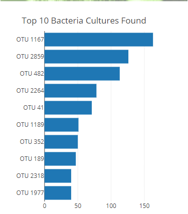
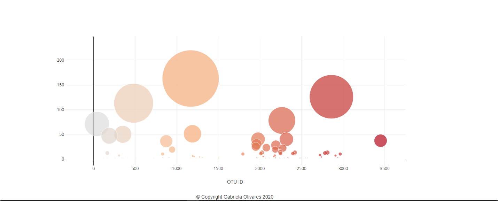
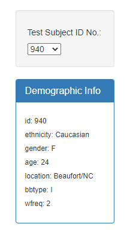
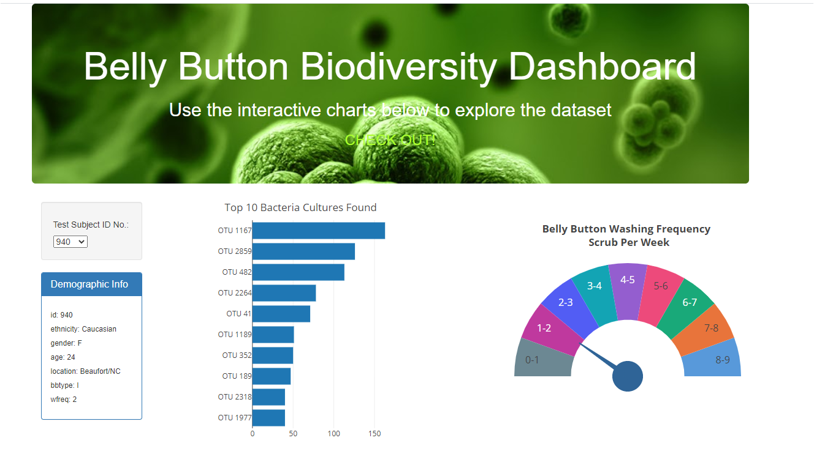
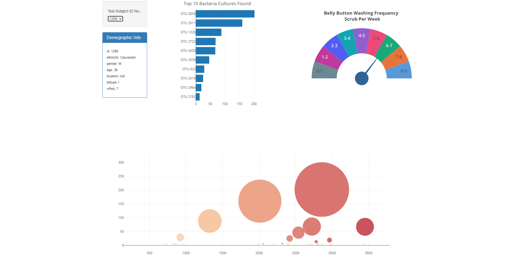
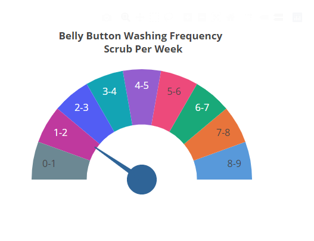

# Plot.ly Homework - Belly Button Biodiversity

In this assignment, I built an interactive dashboard to explore the [Belly Button Biodiversity in my Github Pages](https://gabbyolivares.github.io/Plotly-Challenge/), which catalogs the microbes that colonize human navels.

Results, are given by Subject ID and the dataset reveals that a small handful of microbial species (also called operational taxonomic units, or OTUs, in the study) were present in more than 70% of people, while the rest were relatively rare.

 Visit my link

## Step 1: Plotly

1. Use the D3 library to read in `samples.json`.

2. Create a horizontal bar chart with a dropdown menu to display the top 10 OTUs found in that individual.

* Use `sample_values` as the values for the bar chart.

* Use `otu_ids` as the labels for the bar chart.

* Use `otu_labels` as the hovertext for the chart.

CHALLENGE COMPLETE!!

  

3. Create a bubble chart that displays each sample.

* Use `otu_ids` for the x values.

* Use `sample_values` for the y values.

* Use `sample_values` for the marker size.

* Use `otu_ids` for the marker colors.

* Use `otu_labels` for the text values.

CHALLENGE COMPLETE!!

4. Display the sample metadata, i.e., an individual's demographic information.

5. Display each key-value pair from the metadata JSON object somewhere on the page.

CHALLENGE COMPLETE!!

6. Update all of the plots any time that a new sample is selected.

Create my own layout as shown below:

## Step 2: Advanced Challenge Assignment (Optional)

The following task was advanced and therefore...SO MUCH FUN!

* I adapted the Gauge Chart from <https://plot.ly/javascript/gauge-charts/> to plot the weekly washing frequency of the individual.

* Then, I modified the example gauge code to account for values ranging from 0 through 9.

* Update the chart whenever a new sample is selected.

## Deployment

* Deploy my app to a free static page hosting service, GitHub Pages.

## Tools and sources

* Plot.ly
* Javascript
* HTML
* D3.js
* JSON
* GitHub and GitHub Pages
* console.log

* Refered to the [Plotly.js documentation](https://plot.ly/javascript/) when building my plots.

* Also refered to other key sources such as  [A customizable D3 gauge](https://oliverbinns.com/articles/D3js-gauge/)

 [Plotly Custom Data](https://www.youtube.com/watch?v=7WkTbPzamaA)

 [Plotly Bar chart](https://www.youtube.com/watch?v=N1GwQNatOwo)

 [Plotly Real time chart](https://www.youtube.com/watch?v=2-tnkzG0sKU&t=4s)

## Author

* **Gabby Olivares** - **[My github](https://github.com/GabbyOlivares "GitHub for Gabby Olivares")**

## Acknowledgments

Hulcr, J. et al.(2012) _A Jungle in There: Bacteria in Belly Buttons are Highly Diverse, but Predictable_. Retrieved from: [http://robdunnlab.com/projects/belly-button-biodiversity/results-and-data/](http://robdunnlab.com/projects/belly-button-biodiversity/results-and-data/)

## Copyright

Copyright:copyright: 2020. All Rights Reserved.

---

##### © 2020 Gabriela Loami Olivares Martinez, BootCamp Tecnologico de Monterrey.
##### © 2019 Trilogy Education Services, a 2U, Inc. brand. All Rights Reserved. 
